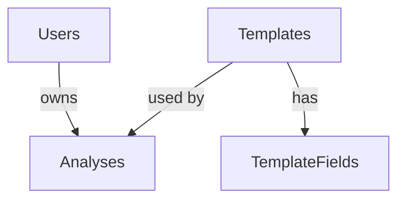

# Database Schema Reference

## Tables Overview

### Users Table
```sql
CREATE TABLE [Users] (
    [Id] int NOT NULL IDENTITY PRIMARY KEY,
    [Name] nvarchar(max) NOT NULL,
    [Email] nvarchar(450) NOT NULL UNIQUE,
    [PasswordHash] nvarchar(max) NOT NULL,
    [Role] nvarchar(max) NOT NULL DEFAULT 'user',
    [CreatedAt] datetime2 NOT NULL DEFAULT GETUTCDATE()
);
```

**Columns:**
- `Id` - Primary key, auto-increment
- `Name` - User's full name
- `Email` - Unique email address (indexed)
- `PasswordHash` - BCrypt hashed password
- `Role` - 'user' or 'admin'
- `CreatedAt` - Account creation timestamp

**Sample Queries:**
```sql
-- Get all users
SELECT * FROM Users;

-- Get admin users only
SELECT * FROM Users WHERE Role = 'admin';

-- Make a user admin
UPDATE Users SET Role = 'admin' WHERE Email = 'user@example.com';
```

---

### Analyses Table
```sql
CREATE TABLE [Analyses] (
    [Id] int NOT NULL IDENTITY PRIMARY KEY,
    [Title] nvarchar(max) NOT NULL,
    [Content] nvarchar(max) NULL,
    [Score] int NOT NULL DEFAULT 0,
    [RiskLevel] nvarchar(max) NOT NULL DEFAULT 'Medium',
    [SuccessPercent] int NOT NULL DEFAULT 0,
    [Investment] decimal(18,2) NOT NULL DEFAULT 0,
    [ExpectedROI] decimal(18,2) NOT NULL DEFAULT 0,
    [CreatedAt] datetime2 NOT NULL DEFAULT GETUTCDATE(),
    [OwnerId] int NOT NULL,
    [TemplateId] int NULL,
    CONSTRAINT [FK_Analyses_Users] FOREIGN KEY ([OwnerId]) 
        REFERENCES [Users] ([Id]) ON DELETE CASCADE,
    CONSTRAINT [FK_Analyses_Templates] FOREIGN KEY ([TemplateId]) 
        REFERENCES [Templates] ([Id]) ON DELETE SET NULL
);
```

**Columns:**
- `Id` - Primary key, auto-increment
- `Title` - Analysis title/name
- `Content` - JSON string of form data
- `Score` - Overall score (0-100)
- `RiskLevel` - 'Low', 'Medium', or 'High'
- `SuccessPercent` - Success probability (0-100)
- `Investment` - Investment amount in currency
- `ExpectedROI` - Expected ROI percentage
- `CreatedAt` - Analysis creation timestamp
- `OwnerId` - Foreign key to Users (CASCADE delete)
- `TemplateId` - Foreign key to Templates (SET NULL on delete)

**Sample Queries:**
```sql
-- Get all analyses with owner info
SELECT 
    a.Id, a.Title, a.Score, a.RiskLevel, a.Investment,
    u.Name AS OwnerName, u.Email AS OwnerEmail
FROM Analyses a
INNER JOIN Users u ON a.OwnerId = u.Id;

-- Get analyses by specific user
SELECT * FROM Analyses WHERE OwnerId = 1;

-- Get high-scoring analyses
SELECT * FROM Analyses WHERE Score >= 80;

-- Delete all analyses for a user (cascade will handle this)
DELETE FROM Users WHERE Id = 1;
```

---

### Templates Table
```sql
CREATE TABLE [Templates] (
    [Id] int NOT NULL IDENTITY PRIMARY KEY,
    [Name] nvarchar(max) NOT NULL,
    [Description] nvarchar(max) NULL,
    [Category] nvarchar(max) NOT NULL DEFAULT 'General',
    [Duration] int NOT NULL DEFAULT 30,
    [IsPopular] bit NOT NULL DEFAULT 0,
    [CreatedAt] datetime2 NOT NULL DEFAULT GETUTCDATE()
);
```

**Columns:**
- `Id` - Primary key, auto-increment
- `Name` - Template name
- `Description` - Template description
- `Category` - Template category (e.g., 'Restaurant', 'Tech', etc.)
- `Duration` - Estimated completion time in minutes
- `IsPopular` - Flag for popular templates (0 or 1)
- `CreatedAt` - Template creation timestamp

**Sample Queries:**
```sql
-- Get all templates
SELECT * FROM Templates;

-- Get popular templates
SELECT * FROM Templates WHERE IsPopular = 1;

-- Add a new template
INSERT INTO Templates (Name, Description, Category, Duration, IsPopular)
VALUES ('AI Business Idea Validator', 'Validate your business idea with AI-powered analysis covering core concept, financial hypotheses, feasibility, market validation, and critical assumptions.', 'Business Validation', 25, 1);
```

---

### TemplateFields Table
```sql
CREATE TABLE [TemplateFields] (
    [Id] int NOT NULL IDENTITY PRIMARY KEY,
    [TemplateId] int NOT NULL,
    [StageNumber] int NOT NULL,
    [FieldOrder] int NOT NULL,
    [Label] nvarchar(100) NOT NULL,
    [InputType] nvarchar(max) NOT NULL,
    [FieldOptions] nvarchar(max) NULL,
    [Rationale] nvarchar(1000) NOT NULL,
    [IsRequired] bit NOT NULL DEFAULT 0,
    [MinLength] int NULL,
    [MaxLength] int NULL,
    [MustBePositive] bit NOT NULL DEFAULT 0,
    [MustBeValidUrl] bit NOT NULL DEFAULT 0,
    [MustBeBetween0And100] bit NOT NULL DEFAULT 0,
    [CreatedAt] datetime2 NOT NULL DEFAULT GETUTCDATE(),
    CONSTRAINT [FK_TemplateFields_Templates] FOREIGN KEY ([TemplateId]) 
        REFERENCES [Templates] ([Id]) ON DELETE CASCADE
);
```

**Columns:**
- `Id` - Primary key, auto-increment
- `TemplateId` - Foreign key to Templates (CASCADE delete)
- `StageNumber` - Stage number (1-5)
- `FieldOrder` - Order within the stage
- `Label` - Field label shown to user
- `InputType` - Text, TextArea, Number, Dropdown, etc.
- `FieldOptions` - JSON string for dropdown options
- `Rationale` - AI prompt rationale
- `IsRequired` - Flag for required fields
- `MinLength` - Minimum length for text fields
- `MaxLength` - Maximum length for text fields
- `MustBePositive` - Flag for positive numbers
- `MustBeValidUrl` - Flag for URL validation
- `MustBeBetween0And100` - Flag for 0-100 range
- `CreatedAt` - Field creation timestamp

**Sample Queries:**
```sql
-- Get all fields for a template
SELECT * FROM TemplateFields WHERE TemplateId = 1 ORDER BY StageNumber, FieldOrder;

-- Get fields for a specific stage
SELECT * FROM TemplateFields WHERE TemplateId = 1 AND StageNumber = 1 ORDER BY FieldOrder;

-- Add a new field
INSERT INTO TemplateFields (TemplateId, StageNumber, FieldOrder, Label, InputType, Rationale, IsRequired)
VALUES (1, 1, 0, 'Business Name', 'text', 'Name of the business being analyzed', 1);
```

---

## Relationships



- One User can have many Analyses (1:N)
- One Template can be used by many Analyses (1:N)
- One Template can have many TemplateFields (1:N)
- When a User is deleted, their Analyses are also deleted (CASCADE)
- When a Template is deleted, its TemplateFields and Analyses are handled appropriately (CASCADE for fields, SET NULL for analyses)

---

## Indexes

```sql
-- Unique index on Users.Email
CREATE UNIQUE INDEX [IX_Users_Email] ON [Users] ([Email]);

-- Index on Analyses.OwnerId for faster joins
CREATE INDEX [IX_Analyses_OwnerId] ON [Analyses] ([OwnerId]);

-- Index on Analyses.TemplateId for faster joins
CREATE INDEX [IX_Analyses_TemplateId] ON [Analyses] ([TemplateId]);

-- Index on TemplateFields for faster queries
CREATE INDEX [IX_TemplateFields_TemplateId_StageNumber_FieldOrder] 
ON [TemplateFields] ([TemplateId], [StageNumber], [FieldOrder]);
```

---

## Common Queries

### User Statistics
```sql
-- Count users by role
SELECT Role, COUNT(*) AS UserCount
FROM Users
GROUP BY Role;

-- Users with most analyses
SELECT 
    u.Name, 
    u.Email, 
    COUNT(a.Id) AS AnalysisCount
FROM Users u
LEFT JOIN Analyses a ON u.Id = a.OwnerId
GROUP BY u.Name, u.Email
ORDER BY AnalysisCount DESC;
```

### Analysis Statistics
```sql
-- Average scores by risk level
SELECT 
    RiskLevel, 
    AVG(Score) AS AvgScore,
    COUNT(*) AS Count
FROM Analyses
GROUP BY RiskLevel;

-- Recent analyses (last 7 days)
SELECT * FROM Analyses 
WHERE CreatedAt >= DATEADD(day, -7, GETUTCDATE())
ORDER BY CreatedAt DESC;

-- Total investment amount
SELECT SUM(Investment) AS TotalInvestment FROM Analyses;
```

### Template Statistics
```sql
-- Count templates by category
SELECT Category, COUNT(*) AS TemplateCount
FROM Templates
GROUP BY Category;

-- Popular templates
SELECT * FROM Templates WHERE IsPopular = 1;

-- Templates with field counts
SELECT 
    t.Name,
    t.Category,
    COUNT(tf.Id) AS FieldCount
FROM Templates t
LEFT JOIN TemplateFields tf ON t.Id = tf.TemplateId
GROUP BY t.Name, t.Category;
```

### Combined Statistics
```sql
-- Dashboard stats
SELECT 
    (SELECT COUNT(*) FROM Users) AS TotalUsers,
    (SELECT COUNT(*) FROM Users WHERE Role = 'admin') AS AdminUsers,
    (SELECT COUNT(*) FROM Analyses) AS TotalAnalyses,
    (SELECT AVG(Score) FROM Analyses) AS AvgScore,
    (SELECT SUM(Investment) FROM Analyses) AS TotalInvestment;
```

---

## Data Seeding (Optional)

### Seed Initial Templates
```sql
INSERT INTO Templates (Name, Description, Category, Duration, IsPopular)
VALUES 
    ('AI Business Idea Validator', 'Validate your business idea with AI-powered analysis covering core concept, financial hypotheses, feasibility, market validation, and critical assumptions.', 'Business Validation', 25, 1),
    ('AI-Powered SWOT & PESTEL Builder', 'Comprehensive SWOT and PESTEL analysis to evaluate your business strengths, weaknesses, opportunities, threats, and external factors.', 'SWOT & PESTEL', 30, 1),
    ('Building the Marketing Plan', 'Create a comprehensive marketing plan with target audience definition, budget allocation, channels, USP, and KPIs.', 'Marketing', 20, 0),
    ('Financial Performance Assessment', 'Evaluate your financial health with detailed analysis of revenue, costs, profits, and advanced financial metrics.', 'Financial', 20, 0),
    ('Assessing Growth Readiness', 'Determine your business readiness for growth with operational efficiency, leadership, scalability, and financial runway analysis.', 'Growth', 25, 0),
    ('Gap Analysis', 'Identify gaps between your current state and future goals with financial baselines, operational capabilities, and market position analysis.', 'Gap Analysis', 20, 0),
    ('AI Business Health Check', 'Comprehensive health check of your business covering identity, financial indicators, operational efficiency, market relationships, and business vitals.', 'Health Check', 15, 0),
    ('Digital Maturity Assessment', 'Assess your digital maturity across identity, investment, tools, engagement, and dimensions of digital capability.', 'Digital', 25, 0),
    ('AI Pitch Deck Generator', 'Create a compelling pitch deck with core idea, financial model, product details, competitive landscape, and team information.', 'Pitch Deck', 30, 1),
    ('AI-Based Market Opportunity Analyzer', 'Analyze market opportunities with company identity, financial capacity, core competencies, strategic posture, and market evaluation.', 'Market Opportunity', 25, 0);
```

### Seed Test User (Admin)
```sql
-- Note: You need to generate a BCrypt hash for the password
-- This is a placeholder - generate actual hash in your backend
INSERT INTO Users (Name, Email, PasswordHash, Role)
VALUES 
    ('Admin User', 'admin@mashroo3k.com', '$2a$11$hashed_password_here', 'admin');
```

---

## Backup and Restore

### Backup Database
```sql
BACKUP DATABASE [Masroo3kDb]
TO DISK = 'C:\Backups\Masroo3kDb.bak'
WITH FORMAT, COMPRESSION, STATS = 10;
```

### Restore Database
```sql
RESTORE DATABASE [Masroo3kDb]
FROM DISK = 'C:\Backups\Masroo3kDb.bak'
WITH REPLACE, STATS = 10;
```

---

## Maintenance Queries

### Clean Up Old Data
```sql
-- Delete analyses older than 1 year
DELETE FROM Analyses 
WHERE CreatedAt < DATEADD(year, -1, GETUTCDATE());

-- Delete inactive users (no analyses in 6 months)
DELETE FROM Users 
WHERE Id NOT IN (
    SELECT DISTINCT OwnerId FROM Analyses 
    WHERE CreatedAt >= DATEADD(month, -6, GETUTCDATE())
)
AND Role = 'user';
```

### Check Database Size
```sql
EXEC sp_spaceused 'Users';
EXEC sp_spaceused 'Analyses';
EXEC sp_spaceused 'Templates';
EXEC sp_spaceused 'TemplateFields';
```